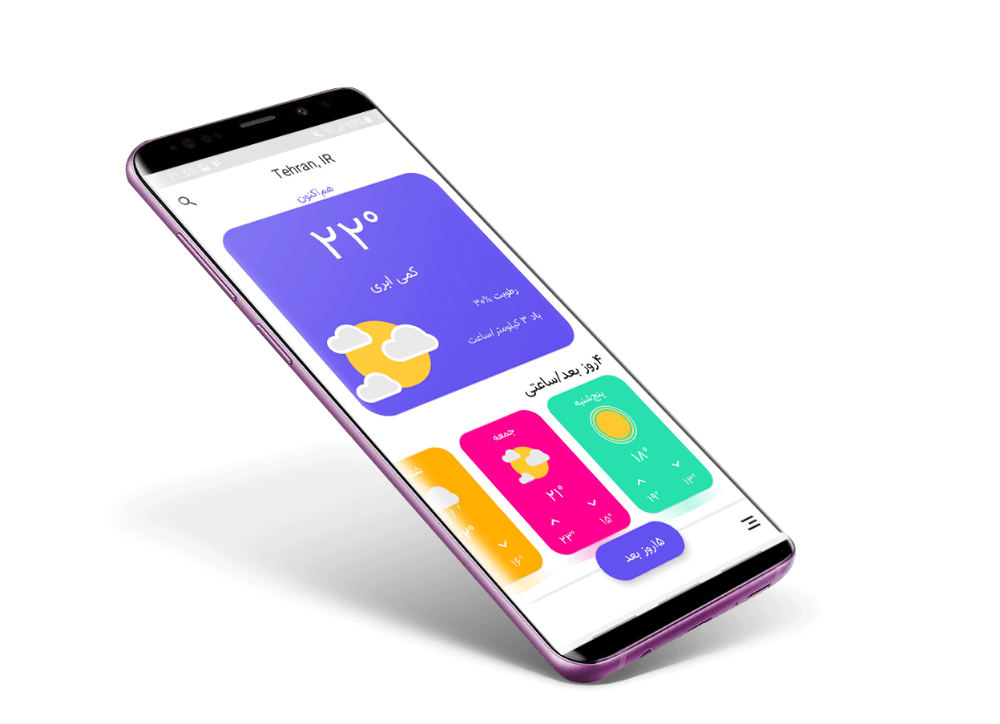

# برنامه هواشناسی

**نیازمندی‌ها**
- Android Studio 3.5 beta 2
- JDK 8
- Android SDK 28
- Supports API Level +17
- Material Components 1.1.0-alpha05

**ویژگی‌ها**
- Use [OpenWeatherMap] API
- Use Material Design 2
- Support two language. English & Persian
- Use locale Database

**عکس برنامه**

**Credit**

### This app inspired from [Weather App Freebie] concept Designed by [Raman Yv] 

# License

    Copyright 2019 Behrouz Khezry

    Licensed under the Apache License, Version 2.0 (the "License");
    you may not use this file except in compliance with the License.
    You may obtain a copy of the License at

       http://www.apache.org/licenses/LICENSE-2.0

    Unless required by applicable law or agreed to in writing, software
    distributed under the License is distributed on an "AS IS" BASIS,
    WITHOUT WARRANTIES OR CONDITIONS OF ANY KIND, either express or implied.
    See the License for the specific language governing permissions and
    limitations under the License.
    
